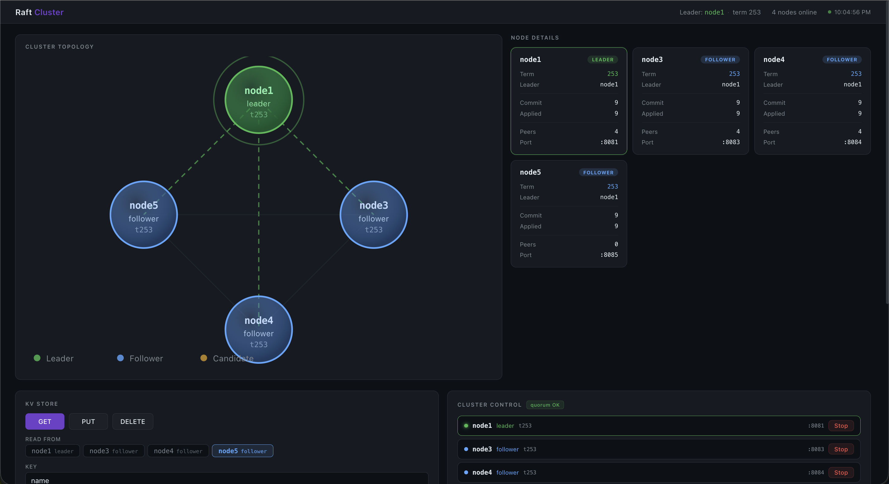
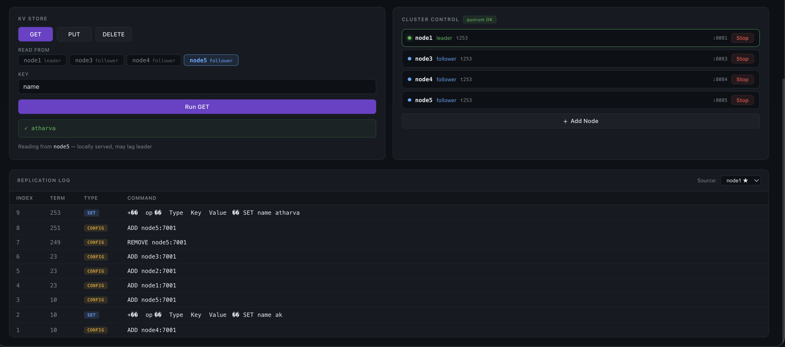

# Raft Consensus — Distributed KV Store

A complete implementation of the Raft consensus algorithm in Go, with a linearizable key-value store built on top, gRPC/protobuf transport for inter-node RPCs, HTTP/JSON API for clients, Docker containerization, live cluster membership changes, a sidecar process for container lifecycle management, and a real-time React dashboard for cluster visualization and control.

---

## Table of Contents

- [What is Raft?](#what-is-raft)
- [What Problem Does It Solve?](#what-problem-does-it-solve)
- [Raft vs Paxos](#raft-vs-paxos)
- [The Three Guarantees](#the-three-guarantees)
- [Real World Usage](#real-world-usage)
- [Architecture](#architecture)
- [Dashboard & Sidecar](#dashboard--sidecar)
  - [Screenshots](#screenshots)
- [Package Structure](#package-structure)
- [Checkpoints Implemented](#checkpoints-implemented)
- [Implementation Modifications & Fixes](#implementation-modifications--fixes)
- [Raft Concepts and Conditions](#raft-concepts-and-conditions)
- [Code Flow](#code-flow)
- [Use Cases with Diagrams](#use-cases-with-diagrams)
- [Deployment](#deployment)
- [API Reference](#api-reference)
- [Observability](#observability)
- [Debug Tools](#debug-tools)
- [Known Limitations](#known-limitations)

---

## What is Raft?

Raft is a **distributed consensus algorithm** — a protocol that allows a cluster of servers to agree on a sequence of values even when some servers crash or become unreachable.

It was introduced in the 2014 paper *"In Search of an Understandable Consensus Algorithm"* by Diego Ongaro and John Ousterhout at Stanford. The core design goal was understandability: Raft was explicitly designed to be easier to teach, implement, and reason about than Paxos.

At its heart, Raft answers one question: **how do N machines maintain an identical, ordered log of commands, even when machines fail?**

---

## What Problem Does It Solve?

### The Split-Brain Problem

In a distributed system with a single primary server, if the primary crashes:
- Clients cannot write new data
- If a new primary is elected without coordination, two primaries might both accept writes — leading to **split-brain**: two servers with diverging state, no way to reconcile

Raft solves this by requiring a **majority quorum** for every decision. In a 3-node cluster, at least 2 nodes must agree before any write is committed. This makes it mathematically impossible to have two leaders simultaneously — there is only one majority.

### The Data Loss Problem

Without a replicated log, a crashed server loses its data. Raft maintains a **replicated log** — every write is copied to a majority of nodes before being acknowledged. If the leader crashes, any node that received a quorum of writes can become the new leader with no data loss.

### The Consistency Problem

Without coordination, two clients reading from two different servers might get different values. Raft provides **linearizability**: every read and write appears to happen at a single point in time, on a single logical machine, even though it runs on many physical machines.

---

## Raft vs Paxos

| | Raft | Paxos |
|---|---|---|
| Designed for | Understandability | Theoretical correctness |
| Leader | Strong single leader | Multi-leader variants exist |
| Log structure | Explicit, ordered | Implicit |
| Membership changes | Defined in paper | Left to implementer |
| Real implementations | etcd, CockroachDB, Consul | Chubby (Google), Zookeeper |
| Learning curve | Lower | Very high |

Raft decomposes consensus into three largely independent subproblems — leader election, log replication, and safety — and solves each one explicitly.

---

## The Three Guarantees

**Safety** — Nothing bad ever happens:
- At most one leader per term
- A committed entry is never lost
- All nodes apply the same commands in the same order

**Liveness** — Something good eventually happens:
- A leader will always be elected (given enough time without network failures)
- Committed entries will eventually be applied on all nodes

**Fault Tolerance** — The system survives failures:
- A cluster of N nodes tolerates `floor((N-1)/2)` simultaneous failures
- 3 nodes → tolerate 1 failure
- 5 nodes → tolerate 2 failures

---

## Real World Usage

| System | Uses Raft For |
|---|---|
| **etcd** | Kubernetes cluster state, service discovery |
| **CockroachDB** | Distributed SQL transactions per range |
| **Consul** | Service mesh, distributed KV, leader election |
| **TiKV** | Distributed storage layer for TiDB |
| **YugabyteDB** | Distributed ACID transactions |
| **InfluxDB** | Cluster metadata coordination |

---

## Architecture

### Cluster Overview

```
                        ┌─────────────────────────────────────┐
                        │           Raft Cluster               │
                        │                                      │
   ┌──────────────┐     │  ┌──────────┐      ┌──────────┐    │
   │              │     │  │  node1   │◄────►│  node2   │    │
   │   Client     │────►│  │ (leader) │      │(follower)│    │
   │ (curl/HTTP)  │     │  └──────────┘      └──────────┘    │
   │              │     │        │▲                 │         │
   └──────────────┘     │        ││                 │         │
                        │        ▼│           ┌──────────┐    │
                        │  ┌──────────┐       │  node3   │    │
                        │  │  node4   │◄─────►│(follower)│    │
                        │  │(follower)│       └──────────┘    │
                        │  └──────────┘                       │
                        └─────────────────────────────────────┘

   Ports (per node):
     :7001  Raft gRPC  (AppendEntries, RequestVote, InstallSnapshot — protobuf binary)
     :808x  KVStore HTTP API  (GET /keys/, PUT /keys/, DELETE /keys/ — JSON)
```

### Full System with Dashboard & Sidecar

```
  Browser (React Dashboard)
       │  poll every 2 s
       │  POST /nodes/create
       │  POST /nodes/{id}/stop
       ▼
  ┌─────────────────────────────┐
  │   cmd/sidecar  :9090        │   ← Go HTTP server, single source of truth
  │                             │
  │  GET /nodes ──► polls all   │
  │               node /status  │
  │                             │
  │  POST /nodes/create         │
  │   └─ docker compose up      │
  │      docker run (custom)    │
  │      clearNodeData()        │
  │      raftAddNode (leader)   │
  │                             │
  │  POST /nodes/{id}/stop      │
  │   └─ raftRemoveNode         │
  │      docker compose stop    │
  │      docker rm (custom)     │
  └──────────┬──────────────────┘
             │  docker API + Raft HTTP admin API
             ▼
  ┌──────────────────────────────────────────────┐
  │             Docker (infra_default network)    │
  │                                              │
  │  infra-node1-1  :8081/:7001                  │
  │  infra-node2-1  :8082/:7002                  │
  │  infra-node3-1  :8083/:7003                  │
  │  infra-node4-1  :8084/:7004   (preset, non-bootstrap)  │
  │  infra-node5-1  :8085/:7005   (preset, non-bootstrap)  │
  │  raft-nodeX     :888x/:700x   (custom, dynamic)        │
  └──────────────────────────────────────────────┘
```

### Two Address Spaces

```
  Inside Docker (container DNS):               Outside Docker (host machine):
  ┌──────────────────────────────────┐         ┌───────────────────────────┐
  │  node1:7001  Raft gRPC (proto)   │         │  localhost:8081  HTTP API  │
  │  node2:7001  Raft gRPC (proto)   │         │  localhost:8082  HTTP API  │
  │  node3:7001  Raft gRPC (proto)   │         │  localhost:8083  HTTP API  │
  │  node4:7001  Raft gRPC (proto)   │         │  localhost:8084  HTTP API  │
  │  node5:7001  Raft gRPC (proto)   │         │  localhost:8085  HTTP API  │
  └──────────────────────────────────┘         └───────────────────────────┘
      used by Raft nodes (binary protobuf)         used by clients (curl/JSON)
      to replicate entries over HTTP/2             to read/write data

  Sidecar:
  ┌──────────────────────────────────┐         ┌───────────────────────────┐
  │  localhost:808x/status  (Raft)   │◄────────│  localhost:9090  (sidecar)│
  │  localhost:808x/admin/*          │         └───────────────────────────┘
  └──────────────────────────────────┘
      sidecar talks to node HTTP APIs             dashboard talks only to sidecar
      to poll status and call admin endpoints     (no CORS issues)
```

### Package Dependency Diagram

```
  ┌─────────────────────────────────────────────┐
  │              cmd/kvstore                     │
  │   main.go — wires everything together        │
  │   HTTP server, env config, admin endpoints   │
  └─────────────┬───────────────┬───────────────┘
                │               │
                ▼               ▼
  ┌─────────────────┐  ┌────────────────────────┐
  │    kvstore/     │  │        raft/            │
  │  KVStore        │  │  RaftNode (core)        │
  │  Apply()        │  │  Log, Transport         │
  │  Snapshot()     │  │  Election, Replication  │
  │  Restore()      │  │  Persistence, Snapshot  │
  └─────────────────┘  └──────────┬─────────────┘
         │                        │  uses Transport interface
         │               ┌────────▼───────────┐
         │               │      proto/         │
         │               │  raft.proto         │
         │               │  raft.pb.go         │
         │               │  raft_grpc.pb.go    │
         │               │  (gRPC + protobuf)  │
         │               └────────────────────┘
         └──────────┬─────────────┘
                    ▼
         ┌────────────────────┐    ┌──────────────────────┐
         │      infra/        │    │    cmd/sidecar/       │
         │  Dockerfile        │    │  main.go — Docker +  │
         │  docker-compose    │    │  Raft admin bridge   │
         └────────────────────┘    └──────────────────────┘
                                            ▲
                                            │ HTTP :9090
                                   ┌────────────────────┐
                                   │    dashboard/       │
                                   │  React + TypeScript │
                                   │  Vite dev server    │
                                   └────────────────────┘
```

---

## Dashboard & Sidecar

### Overview

The project ships a browser-based dashboard for real-time cluster visualization and control. Instead of running `curl` commands manually, everything can be done from the UI.

```
┌─────────────────────────────────────────────────────────────────┐
│  Raft Cluster Dashboard                                          │
│                                                                  │
│  ┌─────────────────────────┐  ┌──────────────────────────────┐  │
│  │   Cluster Topology      │  │   Node Details               │  │
│  │   (SVG graph)           │  │   node1  LEADER  t5          │  │
│  │                         │  │   node2  FOLLOWER t5         │  │
│  │  node2 ─── node1(leader)│  │   node3  FOLLOWER t5         │  │
│  │       \   /             │  └──────────────────────────────┘  │
│  │        node3            │                                     │
│  └─────────────────────────┘                                     │
│                                                                  │
│  ┌──────────────────────┐   ┌──────────────────────────────┐    │
│  │  KV Store            │   │  Cluster Control             │    │
│  │  GET  PUT  DELETE    │   │  • node1 leader  :8081  Stop │    │
│  │  Key: [         ]    │   │  • node2 follower:8082  Stop │    │
│  │  Value: [       ]    │   │  + Add Node                  │    │
│  │  [ Run GET ]         │   └──────────────────────────────┘    │
│  └──────────────────────┘                                        │
│                                                                  │
│  ┌──────────────────────────────────────────────────────────┐   │
│  │  Replication Log  Source: node1 ★                        │   │
│  │  Index  Term  Type    Command                            │   │
│  │  10     5     SET     username = alice                   │   │
│  │  9      5     SET     version = 2                        │   │
│  └──────────────────────────────────────────────────────────┘   │
└─────────────────────────────────────────────────────────────────┘
```

### Sidecar (`cmd/sidecar`)

The sidecar is a lightweight Go HTTP server (`:9090`) that acts as the bridge between the browser and Docker/Raft. The browser talks only to the sidecar — never directly to node ports — which eliminates CORS restrictions entirely.

**Endpoints:**

| Method | Path | Description |
|---|---|---|
| `GET` | `/nodes` | Poll all known nodes concurrently, return combined Docker + Raft status |
| `POST` | `/nodes/create` | Start a node (preset or dynamic), call add-node on the cluster leader |
| `POST` | `/nodes/{id}/stop` | Remove from cluster, stop container, clean up |

**Node types:**

| Type | Definition | How started | How stopped |
|---|---|---|---|
| Bootstrap preset (node1–3) | In docker-compose, `RAFT_PEERS` set to peers | `docker compose up --build` | `docker compose stop` |
| Non-bootstrap preset (node4–5) | In docker-compose, `RAFT_PEERS=""` | `docker compose up --build` + `add-node` | `remove-node` + `docker compose stop` |
| Dynamic (custom) | Created at runtime via UI | `docker run` on `infra_default` network + `add-node` | `remove-node` + `docker stop/rm` |

**`GET /nodes` response — `NodeInfo` fields:**

```json
[
  {
    "id":                  "node1",
    "rpc_addr":            "node1:7001",
    "http_port":           8081,
    "rpc_port":            7001,
    "bootstrap":           true,
    "dynamic":             false,
    "running":             true,
    "in_cluster":          true,
    "raft_state":          "leader",
    "term":                5,
    "leader":              "node1",
    "peers":               ["node2:7001", "node3:7001"],
    "commit_index":        42,
    "last_applied":        42,
    "heartbeats_sent":     1204,
    "heartbeats_received": 0,
    "snapshot_index":      0
  }
]
```

### Dashboard (`dashboard/`)

React + TypeScript + Vite application. Run with:

```bash
cd dashboard
npm install
npm run dev   # → http://localhost:5173
```

**Components:**

| Component | Description |
|---|---|
| `ClusterGraph` | SVG topology graph with animated leader ring and dashed heartbeat edges |
| `NodeCard` | Per-node stats: term, leader, commit/applied index, peers, port |
| `KVPanel` | GET/PUT/DELETE operations; GET lets you choose which node to read from |
| `MembershipPanel` | Lists running nodes with state dot + Stop button; Add Node form |
| `LogViewer` | Replication log table with source selector across all online nodes |

**Design decisions:**

- The dashboard polls `GET /nodes` every 2 seconds from a single interval in `App.tsx` — no per-component polling
- All node status flows through the sidecar; the browser never hits `:808x` ports for status
- `GET` reads are routed to the user-selected node (stale read by design); `PUT`/`DELETE` go to the leader
- `LogViewer` source dropdown is built from live online nodes, not a hardcoded list

### Screenshots

#### Cluster Topology — 4-node cluster, node1 as leader at term 253



The topology view shows the live cluster at a glance. Each node is drawn as a circle whose color encodes its Raft role (green = leader, blue = follower, yellow = candidate). Dashed edges represent active heartbeat channels from the leader outward to every follower. The animated pulsing ring around node1 confirms it is the current leader. Node cards on the right duplicate the graph state in tabular form — term, leader ID, commit index, applied index, peer count, and HTTP port — refreshed on every 2-second poll.

Key observations visible in this screenshot:
- **node1** (leader, :8081), **node3** (:8083), **node4** (:8084), and **node5** (:8085) have all converged on **term 253** with **commit = applied = 9**, meaning the log is fully replicated and applied on every node.
- **Cluster Control** shows `quorum OK` and lists all four running nodes with per-node Stop buttons for one-click removal.
- The header bar shows `Leader: node1  term 253  4 nodes online` — a persistent cluster health summary always visible at the top regardless of scroll position.
- The KV panel below shows a `GET name` targeting **node5** (follower), demonstrating the per-node read selector.

#### KV Store Operations and Replication Log



The lower half of the dashboard after a full cluster lifecycle — nodes added, removed, and re-added, plus two KV writes:

**KV Store panel (left):**
- `GET name` was issued targeting **node5** (follower) directly — the result `atharva` was returned locally without touching the leader. The footnote "Reading from node5 — locally served, may lag leader" makes the stale-read semantics explicit.
- The Read From selector shows all four online nodes; node5 is highlighted (selected). `node1` carries a `leader` badge. `PUT` and `DELETE` always route to the leader; the selector is hidden for those operations.

**Cluster Control panel (right):**
- Four nodes listed with state dot color coding: green for leader (node1), blue for followers (node3, node4, node5). All show `t253`. Each row has an HTTP port badge and a Stop button.

**Replication Log (bottom):**
- Sourced from **node1 ★** (the leader) — its log is the authoritative copy.
- **Index 9, term 253** — `SET name atharva` — the most recent write.
- **Index 8, term 251** — `CONFIG ADD node5:7001` — node5 rejoined the cluster.
- **Index 7, term 249** — `CONFIG REMOVE node5:7001` — node5 was previously stopped via the UI.
- **Index 4–6, term 23** — `CONFIG ADD node1/node2/node3:7001` — the original cluster formation.
- **Index 2, term 10** — `SET name ak` — an earlier write, still present in the log (Raft never deletes committed entries).
- **Index 1, term 10** — `CONFIG ADD node4:7001` — node4 was the first node joined to the bootstrap cluster.

This log is a complete audit trail of the cluster's lifetime: membership changes and data writes interleaved in a single ordered sequence, exactly as Raft specifies.

---

## Package Structure

```
.
├── proto/
│   ├── raft.proto            # gRPC service + protobuf message definitions (source of truth)
│   ├── raft.pb.go            # generated — protobuf message structs
│   └── raft_grpc.pb.go       # generated — RaftClient + RaftServer interfaces
│
├── raft/
│   ├── node.go               # RaftNode struct, Config, Submit, AddPeer, RemovePeer, applyConfigEntry
│   ├── election.go           # becomeFollower/Candidate/Leader, startElection, HandleRequestVote
│   ├── replication.go        # sendHeartbeats, sendToPeer, maybeCommit, HandleAppendEntries
│   ├── apply.go              # applyLoop — applies committed entries to state machine
│   ├── log.go                # Log struct, LogEntry, append/get/slice/compactTo
│   ├── persist.go            # persist(), loadState() — crash-safe atomic writes to disk
│   ├── snapshot.go           # TakeSnapshot, HandleInstallSnapshot, sendSnapshotToPeer
│   ├── rpc.go                # Go structs: RequestVoteArgs/Reply, AppendEntriesArgs/Reply
│   ├── transport.go          # Transport interface (implemented by grpc and memory transports)
│   ├── transport_grpc.go     # GRPCTransport — protobuf over HTTP/2, used in Docker
│   ├── transport_http.go     # HTTPTransport — JSON over HTTP (legacy, kept for reference)
│   ├── transport_memory.go   # MemoryTransport — in-process, used in tests
│   └── state_machine.go      # StateMachine interface (Apply, Snapshot, Restore)
│
├── kvstore/
│   └── kvstore.go            # KVStore — implements StateMachine, linearizable Set/Get/Delete
│
├── cmd/
│   ├── kvstore/main.go       # binary entrypoint — wires Raft + KVStore + HTTP server
│   ├── sidecar/main.go       # sidecar server :9090 — Docker lifecycle + Raft admin bridge
│   └── readstate/main.go     # debug tool — decodes raft-state.bin to human-readable JSON
│
├── dashboard/
│   ├── src/
│   │   ├── App.tsx           # root component, 2-second poller, layout
│   │   ├── api.ts            # fetch helpers for sidecar + node HTTP APIs
│   │   ├── types.ts          # TypeScript interfaces: NodeStatus, LogEntry, SidecarNodeInfo
│   │   ├── index.css         # global dark-theme design system
│   │   └── components/
│   │       ├── ClusterGraph.tsx    # SVG topology with gradient nodes and animated edges
│   │       ├── NodeCard.tsx        # per-node stats card
│   │       ├── KVPanel.tsx         # GET/PUT/DELETE UI with per-node read selector
│   │       ├── MembershipPanel.tsx # cluster control: node list + Add Node form
│   │       └── LogViewer.tsx       # replication log table with dynamic source selector
│   ├── package.json
│   └── vite.config.ts
│
└── infra/
    ├── Dockerfile            # multi-stage build — Go builder + minimal alpine runtime
    └── docker-compose.yml    # 5-node cluster definition (node1–5) with named volumes
```

---

## Checkpoints Implemented

| Checkpoint | Description |
|---|---|
| 1 | Project scaffold — module, core types, interfaces |
| 2 | Node state transitions, persistence, event loop |
| 3 | Leader election — RequestVote RPC, randomized timeouts |
| 4 | Log replication — AppendEntries, consistency check, commit |
| 5 | Persistence — crash-safe atomic writes (fsync + rename) |
| 6 | Log compaction — snapshots, compactTo, InstallSnapshot |
| 7 | Snapshot install — lagging follower catch-up via snapshot RPC |
| 8 | Apply loop — committed entries applied to state machine asynchronously |
| 9 | KVStore state machine — linearizable SET/GET/DEL over Raft log |
| 10 | gRPC/protobuf transport + Docker — binary RPC over HTTP/2, containerized cluster |
| 11 | Dynamic membership — live add/remove nodes via config log entries |
| 12 | Sidecar + Dashboard — container lifecycle management + real-time browser UI |

---

## Implementation Modifications & Fixes

This section documents all changes made beyond the original checkpoint scaffolding.

### Sidecar Server (`cmd/sidecar/main.go`)

**Added from scratch.** The sidecar is a Go HTTP server on `:9090` that bridges the browser dashboard with Docker and the Raft admin API.

**Key design decisions:**

```
Node types
  Bootstrap (node1–3): RAFT_PEERS set → nodes self-form cluster on first start.
                       On re-add: sidecar also calls add-node if a cluster already exists.
  Non-bootstrap (node4–5): RAFT_PEERS="" → must be added via add-node explicitly.
  Dynamic (custom): started via docker run on infra_default network; always uses add-node.
```

**`findOnlinePortExcluding` — leader-first routing:**

Original: returned the first node that responded to `/status` — could be a follower.

Problem: `POST /admin/add-node` on a follower (e.g. node4) redirects to the leader using its local `PEER_HTTP_ADDRS` map. If the leader is a dynamically-added node not present in that map, the follower returns HTTP 500 "unknown leader address".

Fix: three-pass resolution:
1. Find a node whose `/status` reports `state == "leader"` — send directly
2. If not found, resolve the leader's HTTP port from our node registry using the follower's reported `leader` field
3. Fall back to any online node

```go
// Pass 1: self-identified leader
for _, r := range live {
    if r.st.State == "leader" { return r.node.HTTPPort }
}
// Pass 2: resolve leader port from registry
for _, r := range live {
    leaderID := strings.Split(r.st.Leader, ":")[0]
    for _, n := range all {
        if n.ID == leaderID { return n.HTTPPort }
    }
}
```

**`clearNodeData` — wipe volume before restart:**

Problem: `docker compose stop` leaves the container in "exited" state; the container still holds a reference to its Docker volume. A node that restarts with a high persisted term (from failed elections while isolated) sends that term to the current leader — the leader steps down immediately, triggering unnecessary re-elections and extended instability.

Fix: before every `docker compose up`, force-remove the stopped container to release the volume reference, then remove the volume. `docker compose up` creates both fresh.

```go
func clearNodeData(nodeID string) {
    // Step 1: release volume reference from stopped container
    exec.Command("docker", "compose", "-f", composeFile, "rm", "-f", "-s", nodeID).CombinedOutput()
    // Step 2: remove the volume (docker compose up creates a fresh one)
    exec.Command("docker", "volume", "rm", projectName+"_"+nodeID+"-data").CombinedOutput()
}
```

**`getBuiltImage` — two-stage image lookup:**

Problem: `docker compose images -q <service>` returns empty on some Docker versions even when the image exists (built but no running containers).

Fix: falls back to `docker image inspect infra-nodeX` which checks if the named image exists directly, regardless of container state.

```go
// Primary: docker compose images -q
// Fallback: docker image inspect infra-node1 (infra-node2, ...)
```

**`startPresetNode` — bootstrap nodes join existing clusters:**

Original: bootstrap nodes always relied on `RAFT_PEERS` for cluster formation. If re-added after a stop (when node2/node3 weren't running), they would enter an infinite election loop.

Fix: after starting, if an active cluster exists (`findOnlinePortExcluding` returns a leader port), call `add-node` on the leader. If `add-node` fails for a bootstrap node (e.g. already a member), the error is non-fatal and logged.

---

### Dashboard (`dashboard/`)

**Added from scratch.** React + TypeScript + Vite.

**Single poller in `App.tsx`:**

Original design had `MembershipPanel` polling `/nodes` independently from `App`. This caused duplicate HTTP requests every second. Fixed by lifting all polling into `App.tsx` and passing `sidecarNodes` as props to `MembershipPanel`.

**`LogViewer` — dynamic source selector:**

Bug: `LogViewer` used the hardcoded `KNOWN_NODES` array for the source dropdown, so dynamically-added nodes (node6, custom IDs) never appeared.

Fix: source selector built from the `nodes` prop (online nodes only). Leader nodes get a ★ marker.

```tsx
// Before (bug): only showed hardcoded node1–5
{KNOWN_NODES.map(n => <option .../>)}

// After: shows all online nodes including custom ones
{nodes.map(n => <option key={n.node_id} value={n.httpPort}>
  {n.node_id}{n.state === 'leader' ? ' ★' : ''}
</option>)}
```

**Port auto-fill in `AddNodeForm`:**

`useEffect` clears port fields when the user switches from a preset ID (e.g. "node1") to a custom ID (e.g. "node-11"). Without this, the preset ports (8081/7001) would persist in the form.

```tsx
useEffect(() => {
  const preset = PRESET[id.trim()];
  setHttpPort(preset ? String(preset.httpPort) : '');
  setRpcPort(preset  ? String(preset.rpcPort)  : '');
}, [id]);
```

**`ClusterGraph` — SVG with radial gradients:**

Nodes use SVG `<radialGradient>` definitions per state (leader/follower/candidate) for a 3D-lit appearance. Node IDs longer than 9 characters are truncated with an ellipsis to avoid overflow. Node positions are calculated dynamically based on actual online node count (not a fixed 5-node ring).

**`NodeCard` — online-only, no dead code:**

Cards are only rendered for online nodes. Removed the offline-state branch and port footer. Term value is colored by state (green for leader, blue for follower, amber for candidate). Snapshot row is hidden when `snapshot_index == 0`.

**`KVPanel` — per-node GET selector:**

GET operations let the user choose which node to read from. The selected node's port is used directly (no redirect to leader). PUT/DELETE still use `leaderPort(nodes)` and redirect automatically. Footer note clarifies read-from vs write-to semantics.

---

### `infra/docker-compose.yml` — node5 added

Added `node5` as a fifth preset service (non-bootstrap, `RAFT_PEERS=""`), with `PEER_HTTP_ADDRS` covering all five nodes, named volume `node5-data`, host ports `8085:8085` and `7005:7001`.

---

## Raft Concepts and Conditions

### Terms

Every action in Raft happens within a **term** — a monotonically increasing integer that acts as a logical clock. A new term begins every time an election starts.

```
Term 1          Term 2          Term 3
┌──────────┐   ┌──────────┐   ┌──────────┐
│ node1    │   │ node2    │   │ node1    │
│ (leader) │   │ (leader) │   │ (leader) │
└──────────┘   └──────────┘   └──────────┘
  election       election       election
  timeout        timeout
```

Rules:
- Each server stores its `currentTerm` on disk — it survives crashes
- If a server sees a message with a higher term, it immediately updates its term and steps down to follower
- Stale messages (lower term) are rejected

### Leader Election

```
All nodes start as Followers
         │
         │ election timer fires (500–1000ms random)
         ▼
    Candidate
    - increment currentTerm
    - vote for self
    - send RequestVote to all peers
         │
    ┌────┴────────────────────────────┐
    │                                 │
    ▼ majority votes received         ▼ sees higher term or loses
  Leader                           Follower
  - send heartbeats every 100ms    - reset election timer
  - replicate log entries          - wait for next heartbeat
```

**Voting conditions** (both must be true to grant a vote):
1. Node has not already voted in this term
2. Candidate's log is at least as up-to-date (higher last term, or same term and longer log)

**Why randomized timeouts?** If all followers had the same timeout, they would all start elections simultaneously, split votes forever, and never elect a leader. Randomization (500–1000ms) ensures one node almost always times out first and wins before the others even start.

### Log Replication

```
Client write: SET key=value
       │
       ▼
  Leader appends entry to its log (index N, term T)
       │
       ├──► AppendEntries ──► node2
       ├──► AppendEntries ──► node3    ← all in parallel
       └──► AppendEntries ──► node4
                │
          majority acks received (e.g. node2 + node3)
                │
                ▼
         commitIndex = N
                │
                ▼
         apply to state machine
                │
                ▼
         reply OK to client
```

**Log Consistency Check** — before accepting entries, a follower verifies that its log matches the leader's at `PrevLogIndex`. If not, it rejects with conflict info so the leader can back up efficiently (skip an entire term per round trip).

**Commit rule** — a leader only commits entries from its **own term**. Entries from previous terms are committed implicitly when a current-term entry is committed. This prevents a subtle data loss scenario described in Raft §5.4.

### Safety Conditions

| Property | Guarantee |
|---|---|
| **Election Safety** | At most one leader per term |
| **Leader Append-Only** | A leader never overwrites its log, only appends |
| **Log Matching** | If two logs have an entry with the same index and term, they are identical up to that index |
| **Leader Completeness** | If an entry is committed in term T, it will be in the log of all leaders with term > T |
| **State Machine Safety** | If a node applies entry N, no other node will apply a different entry at index N |

### Persistence (Raft Figure 2)

Only three fields **must** survive crashes — the rest is recomputed:

| Field | Why it must persist |
|---|---|
| `currentTerm` | Prevents voting twice in the same term after restart |
| `votedFor` | Prevents voting for two different candidates after restart |
| `log entries` | Committed entries must never be lost |

**Crash-safe write pattern:**

```
WRONG:  write → crash → corrupt file on disk

RIGHT:  write to raft-state.bin.tmp
        fsync (flush OS page cache to physical disk)
        rename .tmp → raft-state.bin   ← atomic on POSIX systems
```

Rename is atomic: the OS either completes it or doesn't — the on-disk file is always either the old complete version or the new complete version, never corrupt.

### Snapshotting (Log Compaction)

Without compaction, the log grows forever. Once enough entries are applied, the state machine takes a snapshot:

```
Before snapshot:
  log: [1][2][3][4][5][6][7][8][9][10]
                              ↑ commitIndex=9, lastApplied=9

After snapshot through index 9:
  log: [snapshot@9][10]
       ↑ sentinel

  raft-snapshot.bin: full KVStore state at index 9
```

A lagging follower that needs entries before the snapshot boundary receives an `InstallSnapshot` RPC instead of `AppendEntries` — the leader ships the full snapshot in one call.

### Membership Changes (Raft §6)

Single-server changes (add/remove one node at a time) are safe because any two majorities in the old and new configurations must overlap by at least one node:

```
3-node cluster adding node4:
  Old majority: 2 of {node1, node2, node3}
  New majority: 3 of {node1, node2, node3, node4}
  Overlap: always at least 1 node in common → no split brain possible
```

Config changes are replicated as special log entries (`IsConfig=true`). When committed, all nodes update their peer list.

---

## Code Flow

### Startup Sequence

```
main.go
  │
  ├─ NewGRPCTransport(":7001")    — create gRPC RPC server (protobuf over HTTP/2)
  ├─ kvstore.New(cfg)             — create KVStore + RaftNode
  │     └─ go kv.readApplyCh()   — drain committed entries
  ├─ transport.Register(node)     — wire gRPC handlers → node (grpcHandler)
  ├─ go transport.Serve()         — start Raft gRPC listener
  ├─ go node.Run()                — start Raft event loop
  │     ├─ n.loadState()          — restore term/votedFor/log from disk
  │     ├─ n.restoreFromSnapshot()— rebuild state machine from snapshot
  │     └─ go n.applyLoop()       — background: apply committed entries
  └─ http.ListenAndServe(":808x") — start KVStore HTTP API (clients use this)
```

### Write Flow (PUT)

```
curl -L -X PUT http://localhost:8082/keys/name?value=raft
         │
         ▼
  node2 HTTP handler
  node2 is follower → 302 redirect to leader (node1)
         │
         ▼ (curl follows redirect with -L)
  node1 HTTP handler
  node1 is leader → store.Set("name", "raft")
         │
         ▼
  kvstore.call()
  encodeOp({Type:"SET", Key:"name", Value:"raft"})
  node.Submit(encodedBytes)
         │
         ▼
  RaftNode.Submit() [under lock]
  append LogEntry{Term:T, Index:N, Command:bytes} to log
  persist() → write to raft-state.bin.tmp → fsync → rename
  trigger replication to all peers
         │
    ┌────┴──────────────────────┐
    ▼                           ▼
  sendToPeer(node2)         sendToPeer(node3)
  GRPCTransport.AppendEntries() — Go struct → proto → binary → HTTP/2
  GRPCTransport.AppendEntries() — same
    │                           │
    ▼ Success (proto reply)     ▼ Success (proto reply)
  matchIndex[node2]=N       matchIndex[node3]=N
  maybeCommit()
         │
         ▼
  majority reached → commitIndex = N
  notifyCommit() → wake applyLoop
         │
         ▼
  applyLoop: stateMachine.Apply(command)
  kvstore: kv.data["name"] = "raft"
  applyCh ← ApplyMsg{Index:N, Term:T, Result:...}
         │
         ▼
  kvstore.readApplyCh: route result to pending caller
  pendingCall.ch ← applyResult{}
         │
         ▼
  kvstore.Set() returns nil → HTTP 200 OK
```

### Read Flow (GET)

```
curl http://localhost:8083/keys/name
         │
         ▼
  node3 HTTP handler
  r.Method == GET → serve locally (no redirect)
         │
         ▼
  store.Get("name")
  kv.mu.RLock()
  return kv.data["name"]   ← direct map lookup, no Raft involved
         │
         ▼
  200 OK: "raft"
```

### Leader Election Flow

```
node2 election timer fires (no heartbeat for 500–1000ms)
         │
         ▼
  becomeCandidate()
  currentTerm++, votedFor = self, persist()
         │
         ├──► RequestVote(term=T) ──► node1 (granted)
         ├──► RequestVote(term=T) ──► node3 (granted)
         │
  votes = 3 >= majority = 2
         │
         ▼
  becomeLeader()
  nextIndex[peer] = lastIndex+1, matchIndex[peer] = 0
         │
         ▼
  immediate heartbeat to all peers
  peers reset election timers, acknowledge node2 as leader
```

### Crash Recovery Flow

```
node crashes (power cut, kill, docker stop)
         │
         ▼
node restarts (docker start)
         │
         ▼
Run()
  loadState()
  ├─ open raft-state.bin
  └─ restore: currentTerm, votedFor, log entries
         │
  restoreFromSnapshot()
  ├─ open raft-snapshot.bin (if exists)
  ├─ stateMachine.Restore(data) — rebuild KVStore map
  └─ advance lastApplied/commitIndex to snapshot index
         │
  go applyLoop()
  leader sends heartbeat with LeaderCommit=N
  node: commitIndex = N → applyLoop replays entries
         │
         ▼
node fully recovered, rejoins as follower, no data loss
```

### Node Join Flow (AddPeer)

```
POST /admin/add-node {"addr":"node4:7001"}
         │ (redirects to leader if needed)
         ▼
node.AddPeer("node4:7001")
  submitConfigLocked("add", "node4:7001")
  ├─ append LogEntry{IsConfig:true, ConfigOp:"add", ConfigPeer:"node4:7001"}
  ├─ persist()
  ├─ n.peers = append(n.peers, "node4:7001")  ← immediate replication start
  ├─ nextIndex["node4:7001"] = lastIndex+1
  └─ trigger replication to all peers including node4
         │
  node4 receives entries, catches up:
  ├─ conflict resolution backs nextIndex to 1
  ├─ leader resends all entries from index 1
  └─ if compacted: InstallSnapshot first, then entries
         │
  majority acks config entry → commits
         │
  applyLoop on each node:
  entry.IsConfig → applyConfigEntry()
  node1, node2, node3: add "node4:7001" to n.peers
  node4: skip (own address)
         │
         ▼
  all 4 nodes exchange heartbeats — cluster is fully 4-node
```

### Sidecar Node Lifecycle Flow

```
User clicks "Add Node" (node4) in dashboard
         │
         ▼
POST http://localhost:9090/nodes/create {"id":"node4"}
         │
  clearNodeData("node4")
  ├─ docker compose rm -f -s node4     ← release volume reference
  └─ docker volume rm infra_node4-data ← wipe stale term/log
         │
  docker compose up -d --no-deps --build node4
         │
  waitForHTTP(:8084, 30s)
         │
  findOnlinePortExcluding(8084)
  ├─ Pass 1: find node with state=="leader" → port 8081
  ├─ Pass 2: resolve via leader ID in registry
  └─ Pass 3: any online node
         │
  raftAddNode(8081, "node4:7001")
  POST http://localhost:8081/admin/add-node {"addr":"node4:7001"}
         │
  node4 joins cluster, leader replicates log
         │
         ▼
  {"ok":true,"id":"node4"}
```

---

## Use Cases with Diagrams

### Use Case 1 — Normal Write (PUT)

**Scenario:** Client writes `name=alice` to a follower node.

```
┌────────┐  PUT /keys/name?value=alice   ┌──────────┐
│ Client │ ────────────────────────────► │  node2   │
└────────┘                               │(follower)│
    ▲                                    └────┬─────┘
    │        302 → leader (node1)             │
    │ ◄───────────────────────────────────────┘
    │
    │  PUT /keys/name?value=alice (follows redirect)
    └───────────────────────────────► ┌──────────┐
                                      │  node1   │
                                      │ (leader) │
                                      └────┬─────┘
                                           │ AppendEntries (parallel)
                                     ┌─────┴──────┐
                                     ▼            ▼
                                ┌────────┐   ┌────────┐
                                │ node2  │   │ node3  │
                                └────┬───┘   └────┬───┘
                                     │ ack         │ ack
                                     └──────┬──────┘
                                            │ majority reached
                                            ▼
                                     commit + apply
                                     200 OK → client
```

---

### Use Case 2 — Read (GET) from Any Node

```
┌────────┐  GET /keys/name   ┌───────────────────────────┐
│ Client │ ────────────────► │ node3 (follower)           │
└────────┘                   │ kv.mu.RLock()              │
    ▲                        │ return kv.data["name"]     │
    │   200 OK: alice        └───────────────────────────┘
    └────────────────
```

Key points:
- Reads NEVER go through Raft log — instant, no network hop to leader
- May return data up to 1 heartbeat (~100ms) stale
- Dashboard allows selecting which node to read from

---

### Use Case 3 — Leader Election

**Scenario:** The current leader crashes; the cluster elects a new one.

```
node1 (leader, term 5) — CRASHES
         │
node2, node3, node4 stop receiving heartbeats
         │
each node's election timer counts down (500–1000ms random)
node3 fires first
         │
node3: becomeCandidate()        node2: still counting down
term++ → term=6                 node4: still counting down
votedFor = "node3"
persist()
         │
node3 → RequestVote(term=6) ──► node2 (votes YES)
node3 → RequestVote(term=6) ──► node4 (votes YES)
         │
votes = 3 >= majority(2) → becomeLeader()
         │
node3 → heartbeat ──► node2, node4
```

---

### Use Case 4 — Follower Crash and Recovery

**Scenario:** node3 crashes; writes happen during downtime; node3 restarts.

```
node3 crashes → leader keeps replicating to node2, node4
writes during downtime: SET a=1, SET b=2, SET c=3
         │
node3 restarts → loadState() → restoreSnapshot() → go applyLoop()
         │
leader sends heartbeat: AppendEntries{PrevLogIndex:7, LeaderCommit:7}
node3 log check fails → ConflictIndex = lastIndex+1
leader backs up nextIndex[node3] → resends from correct index
node3 appends, applies entries → fully recovered
```

---

### Use Case 5 — Node Stop and Re-add (via Dashboard)

**Scenario:** User stops node2 and later re-adds it. Without data clearing, node2 restarts with a stale high term and disrupts the leader.

```
User stops node2:
  sidecar → raftRemoveNode(leaderPort, "node2:7001")
  cluster removes node2 from membership (2-node cluster remains)
  sidecar → docker compose stop node2
         │
node2 container exits, volume infra_node2-data retains:
  currentTerm=28, votedFor="...", log=[...]
         │
User adds node2 again:
  sidecar → clearNodeData("node2")
    docker compose rm -f -s node2  ← releases volume reference
    docker volume rm infra_node2-data
  sidecar → docker compose up --build node2
    new empty volume created
    node2 starts at term=0
  sidecar → findOnlinePortExcluding(8082) → leader port
  sidecar → raftAddNode(leaderPort, "node2:7001")
  leader replicates log → node2 catches up as follower
         │
         ▼
No term disruption. Cluster stable.

  WITHOUT clearNodeData (old behavior):
    node2 restarts with term=28, cluster at term=12
    node2 sends heartbeat response with term=28
    → leader sees term=28 > 12 → steps down
    → cluster triggers new election at term=28+
    → instability for several election cycles
```

---

### Use Case 6 — Dynamic Custom Node (via Dashboard)

**Scenario:** User adds a node with a custom ID "node-alpha" at port 8090.

```
User fills form: ID=node-alpha, HTTP=8090, RPC=7090
         │
POST /nodes/create {"id":"node-alpha","http_port":8090,"rpc_port":7090}
         │
sidecar: getBuiltImage()
  → docker image inspect infra-node1 → sha256:4c50...
         │
sidecar: docker run -d \
  --name raft-node-alpha \
  --network infra_default \
  --hostname node-alpha \
  -p 8090:8090 -p 7090:7001 \
  -e NODE_ID=node-alpha \
  -e RAFT_PEERS= \
  -e HTTP_ADDR=:8090 \
  -e DATA_DIR=/data \
  -e PEER_HTTP_ADDRS=node1=localhost:8081,...,node-alpha=localhost:8090 \
  infra-node1
         │
waitForHTTP(:8090) → node-alpha online
         │
findOnlinePortExcluding(8090) → leader port
raftAddNode(leaderPort, "node-alpha:7001")
         │
node-alpha receives log entries, joins as follower
addDynamicNode() → registered in sidecar's runtime registry
```

---

### Use Case 7 — Adding a Node Live (Dynamic Membership)

**Scenario:** Add node4 to a running 3-node cluster without stopping it.

```
  3-node cluster: node1(leader), node2, node3
  Quorum = 2 of 3

  docker compose up node4 -d
  node4 starts with RAFT_PEERS="" → no elections (empty-peers guard)
         │
  POST /admin/add-node {"addr":"node4:7001"}
         │
  node1: submitConfigLocked("add", "node4:7001")
  node1: peers = [node2, node3, node4]  ← immediate (before commit)
  node1: nextIndex[node4]=lastIndex+1
         │
  node1 → AppendEntries ──► node2, node3, node4 (config entry + backfill)
         │
  node4 catches up from index 1
  majority acks (node1+node2+node3 = 3) → config entry commits
         │
  4-node cluster: quorum = 3 of 4
```

---

### Use Case 8 — Removing a Node Safely

**Scenario:** Permanently remove node3 (a follower) from the cluster.

```
  4-node cluster: node1(leader), node2, node3, node4
  Quorum = 3 of 4
         │
  POST /admin/remove-node {"addr":"node3:7001"}
         │
  node1: submitConfigLocked("remove", "node3:7001")
  config entry replicated and committed on node1+node2+node4
         │
  applyConfigEntry on each node:
    node1, node2, node4: remove "node3:7001" from n.peers
    node3 (if running): ConfigPeer==SelfAddr → clear all peers → stop elections
         │
  3-node cluster: node1, node2, node4 — Quorum = 2 of 3
```

---

### Use Case 9 — Network Partition (Split Brain Prevention)

**Scenario:** Network splits into {node1, node2} and {node3, node4}. node1 is leader.

```
  PARTITION:
  Side A: node1(leader), node2   ← 2 of 4 — NOT majority
  Side B: node3, node4           ← 2 of 4 — NOT majority

  Side A: node1 + node2 = 2 of 4 → writes BLOCKED (need 3)
  Side B: node3 or node4 can't win election (need 3 votes)

  BOTH sides deadlocked — no split brain

  Partition heals:
  All 4 reconnect → one leader elected → cluster resumes
```

---

## Deployment

### Prerequisites

- Go 1.21+
- Docker Desktop
- Docker Compose v2
- Node.js 18+ (for dashboard)
- `grpcurl` (optional): `brew install grpcurl`

### Quick Start

**1. Start the Raft cluster (bootstrap nodes):**
```bash
# Start 3 bootstrap nodes (they self-form the cluster)
# Use the dashboard instead — see step 3
```

**2. Start the sidecar:**
```bash
go run ./cmd/sidecar
# → sidecar listening on :9090
```

**3. Start the dashboard:**
```bash
cd dashboard
npm install
npm run dev
# → open http://localhost:5173
```

**4. Add nodes from the UI:**
- Click "Add Node" in the Cluster Control panel
- Type `node1` → ports auto-fill from preset → click "Start Node"
- Repeat for `node2`, `node3`
- The cluster self-bootstraps; a leader is elected within ~1 second

**5. Add custom nodes:**
- Type any ID (e.g. `node-alpha`), enter HTTP port (e.g. 8090), RPC port (optional)
- The sidecar starts a container via `docker run` and calls `add-node` on the leader

### Clean Up Everything

```bash
# Stop and remove all containers + named volumes
docker compose -f infra/docker-compose.yml down -v

# Remove any custom nodes started via docker run
docker ps -a --filter name=raft- --format "{{.Names}}" | xargs -r docker rm -f
```

### Local Run (without Docker)

```bash
# Terminal 1 — node1
NODE_ID=node1 RAFT_RPC_ADDR=:7001 HTTP_ADDR=:8081 DATA_DIR=/tmp/raft/node1 \
RAFT_PEERS=localhost:7002,localhost:7003 \
PEER_HTTP_ADDRS="node1=localhost:8081,node2=localhost:8082,node3=localhost:8083" \
go run ./cmd/kvstore

# Terminal 2 — node2
NODE_ID=node2 RAFT_RPC_ADDR=:7002 HTTP_ADDR=:8082 DATA_DIR=/tmp/raft/node2 \
RAFT_PEERS=localhost:7001,localhost:7003 \
PEER_HTTP_ADDRS="node1=localhost:8081,node2=localhost:8082,node3=localhost:8083" \
go run ./cmd/kvstore

# Terminal 3 — node3
NODE_ID=node3 RAFT_RPC_ADDR=:7003 HTTP_ADDR=:8083 DATA_DIR=/tmp/raft/node3 \
RAFT_PEERS=localhost:7001,localhost:7002 \
PEER_HTTP_ADDRS="node1=localhost:8081,node2=localhost:8082,node3=localhost:8083" \
go run ./cmd/kvstore
```

### Docker Internals

**Why all nodes use the same port `:7001` for Raft RPC:**
Each container has its own network namespace — they don't share ports. `node1`, `node2`, `node3` all listen on `:7001` inside their own container. The host maps them to different ports (`7001`, `7002`, `7003`) only for external access.

**How containers resolve each other:**
Docker Compose creates a bridge network (`infra_default`). Each service name becomes a DNS entry. `node2:7001` inside the Docker network resolves to node2's container IP on port 7001.

**Why `PEER_HTTP_ADDRS` uses `localhost` not container names:**
The 302 redirect URL must be resolvable by the **client** (curl on the host machine), not by containers. `node2:8082` doesn't resolve on the host, but `localhost:8082` does (via Docker port binding).

**Persistent state:**
```
Docker named volume:  infra_node1-data
Mounted at:           /data inside container
Files:
  /data/raft-state.bin      — term, votedFor, log entries
  /data/raft-snapshot.bin   — state machine snapshot
```

### Environment Variables

| Variable | Required | Example | Description |
|---|---|---|---|
| `NODE_ID` | Yes | `node1` | Unique node identifier |
| `RAFT_RPC_ADDR` | Yes | `:7001` | Address to listen for Raft RPCs |
| `HTTP_ADDR` | Yes | `:8081` | Address for KVStore HTTP API |
| `DATA_DIR` | Yes | `/data` | Directory for persistent state |
| `RAFT_PEERS` | No | `node2:7001,node3:7001` | Peer Raft RPC addresses (bootstrap cluster) |
| `PEER_HTTP_ADDRS` | No | `node1=localhost:8081,...` | Peer HTTP addresses for client redirects |

### Manual Cluster Operations (curl)

```bash
# Add a node
curl -X POST http://localhost:8081/admin/add-node \
     -H "Content-Type: application/json" \
     -d '{"addr":"node4:7001"}'

# Remove a node
curl -X POST http://localhost:8081/admin/remove-node \
     -H "Content-Type: application/json" \
     -d '{"addr":"node3:7001"}'

# Write
curl -L -X PUT "http://localhost:8081/keys/name?value=raft"

# Read from any node
curl http://localhost:8083/keys/name
```

---

## API Reference

### KVStore HTTP API (`:808x`)

| Method | Path | Description |
|---|---|---|
| `PUT` | `/keys/{key}?value={val}` | Write a key-value pair |
| `GET` | `/keys/{key}` | Read a value (served locally, may be stale) |
| `DELETE` | `/keys/{key}` | Delete a key |
| `GET` | `/status` | Node health, Raft state, and counters |
| `GET` | `/log` | Full replication log (dashboard use) |
| `POST` | `/admin/add-node` | Add a node to the cluster |
| `POST` | `/admin/remove-node` | Remove a node from the cluster |

**Redirect behaviour:**
- `PUT` / `DELETE` → 302 to leader if called on follower (use `-L`)
- `GET` → served locally, no redirect
- `/admin/*` → 307 to leader (307 preserves POST method, unlike 302)

### Sidecar API (`:9090`)

| Method | Path | Description |
|---|---|---|
| `GET` | `/nodes` | All known nodes with Docker + Raft status |
| `POST` | `/nodes/create` | Start a node and add to cluster |
| `POST` | `/nodes/{id}/stop` | Remove from cluster and stop container |

**`POST /nodes/create` body:**
```json
{ "id": "node4" }                              // preset node — ports from docker-compose
{ "id": "node-alpha", "http_port": 8090 }      // custom node — http_port required
{ "id": "node-alpha", "http_port": 8090, "rpc_port": 7090 }  // explicit RPC port
```

---

## Observability

### `/status` Endpoint

```bash
curl http://localhost:8081/status
```

```json
{
  "node_id":             "node1",
  "state":               "leader",
  "term":                5,
  "leader":              "node1",
  "commit_index":        42,
  "last_applied":        42,
  "heartbeats_received": 0,
  "heartbeats_sent":     1204,
  "peers":               ["node2:7001", "node3:7001"],
  "snapshot_index":      0
}
```

| Field | Description |
|---|---|
| `state` | `follower`, `candidate`, or `leader` |
| `term` | Current term — logical clock, increments on every election |
| `leader` | Node ID of the known leader (`""` during election) |
| `commit_index` | Highest log index committed by majority |
| `last_applied` | Highest log index applied to state machine |
| `heartbeats_received` | Total heartbeats received as follower (~10/sec) |
| `heartbeats_sent` | Total heartbeat rounds sent as leader (~10/sec) |
| `peers` | Current cluster peer list (RPC addresses) |
| `snapshot_index` | Log index of last snapshot (0 if none taken) |

**Reading the counters:**
- Leader: `heartbeats_sent` grows, `heartbeats_received` = 0
- Follower: `heartbeats_received` grows, `heartbeats_sent` = 0
- Both = 0, state = follower: election in progress, no leader yet
- `commit_index` > `last_applied`: apply loop still catching up

---

## Debug Tools

### Inspect Persistent State

```bash
# Copy from container
docker cp infra-node1-1:/data/raft-state.bin /tmp/node1-state.bin

# Decode to JSON
go run ./cmd/readstate /tmp/node1-state.bin
```

```json
{
  "CurrentTerm": 5,
  "VotedFor": "node2",
  "Entries": [
    {"Term": 1, "Index": 1, "Command": "..."},
    {"Term": 2, "Index": 2, "Command": "..."}
  ]
}
```

### Inspect a Snapshot

```bash
docker cp infra-node1-1:/data/raft-snapshot.bin /tmp/node1-snap.bin
go run ./cmd/readstate /tmp/node1-snap.bin
```

### Watch Status Live

```bash
watch -n 1 'curl -s http://localhost:8081/status | python3 -m json.tool'
```

### Inspect gRPC Endpoints (grpcurl)

```bash
# List available services
grpcurl -plaintext localhost:7001 list
# → raft.Raft

# List methods
grpcurl -plaintext localhost:7001 list raft.Raft
# → raft.Raft.AppendEntries
# → raft.Raft.InstallSnapshot
# → raft.Raft.RequestVote

# Send a RequestVote manually
grpcurl -plaintext \
  -d '{"term":1,"candidateId":"node1","lastLogIndex":0,"lastLogTerm":0}' \
  localhost:7001 raft.Raft/RequestVote
```

---

## Known Limitations

| Limitation | Description | Production Solution |
|---|---|---|
| **Stale reads** | GET served locally — may be ~100ms behind leader | Read index or leader leases |
| **2-node quorum fragility** | A 2-node cluster requires both nodes for quorum; one failure blocks all writes | Always run 3+ nodes |
| **Leader removal** | Must do a write after remove-node to cascade-commit the removal entry | Leader transfer before removal |
| **Laptop sleep** | Goroutines freeze, timers expire, burst of elections on wake | Always-on servers |
| **No learner state** | New node counts toward quorum immediately on AddPeer | Non-voting learner until caught up, then promote |
| **Single machine** | All nodes on one host = no real fault tolerance | Deploy across machines or availability zones |
| **No TLS** | gRPC Raft RPCs and KVStore HTTP traffic are plaintext | Mutual TLS on gRPC, TLS on HTTP API |
| **Sidecar state in-memory** | Dynamic nodes (added via UI) are lost if sidecar restarts | Persist node registry to disk |
| **Data cleared on re-add** | Nodes start fresh every re-add (no incremental catch-up) | Acceptable for dev/demo; production would rejoin with data intact |
