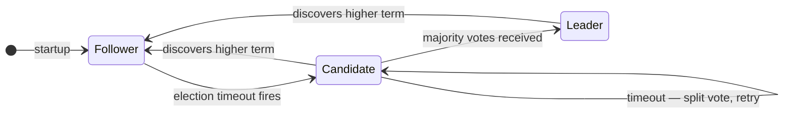
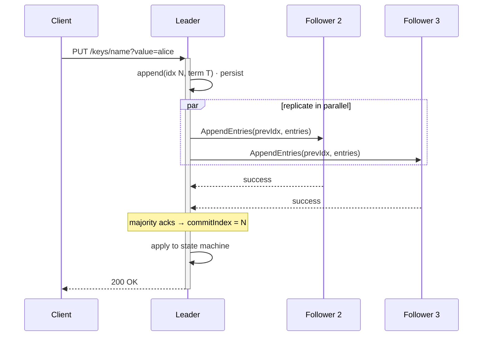
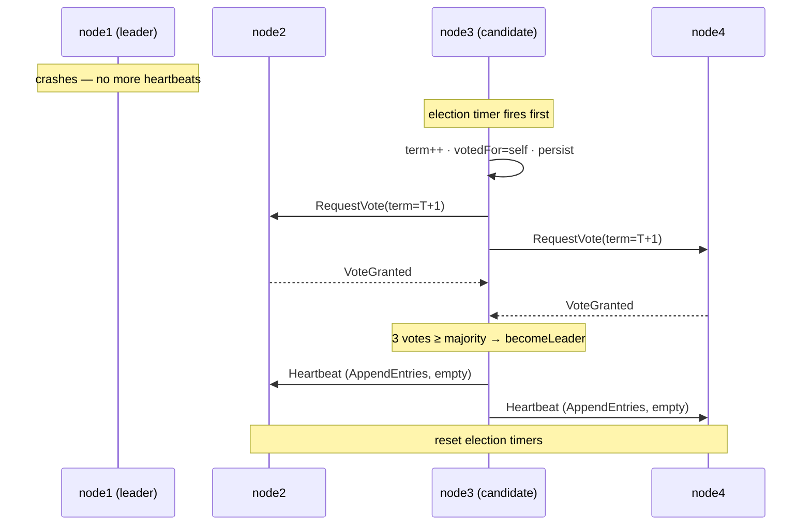
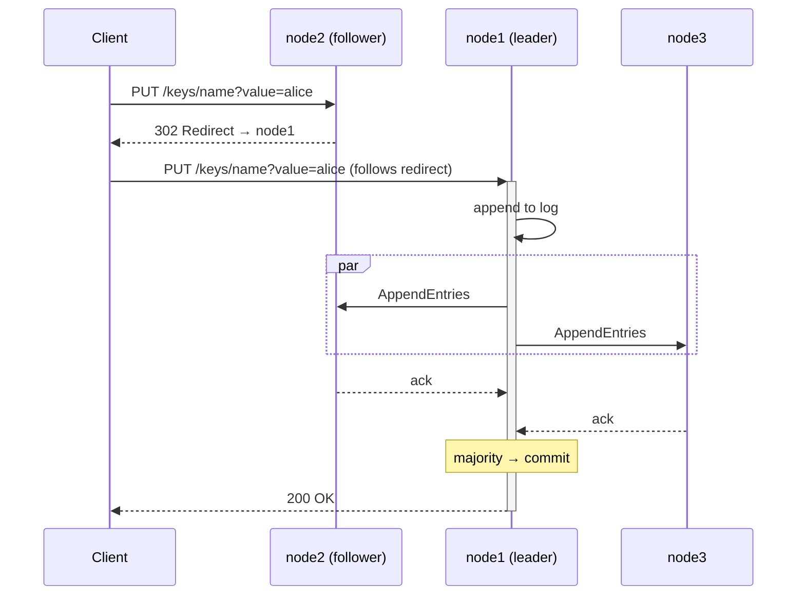
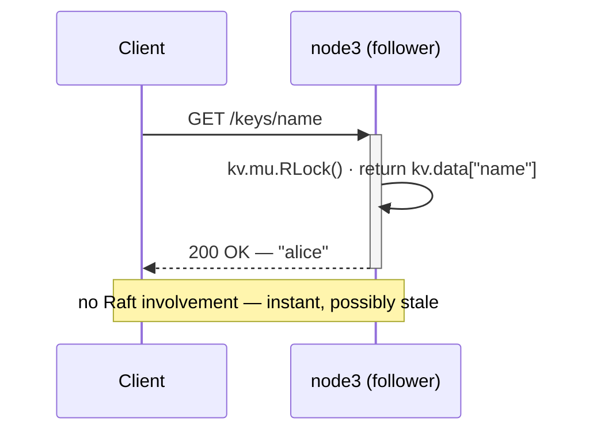
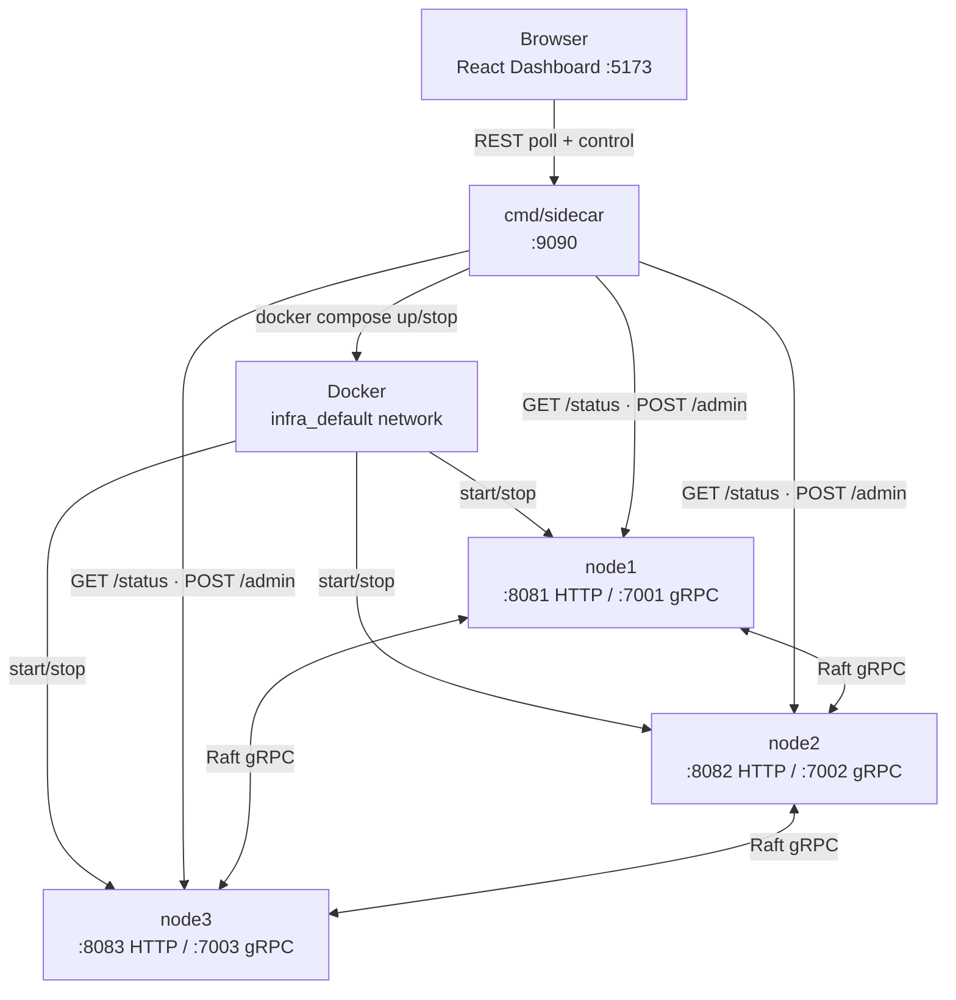
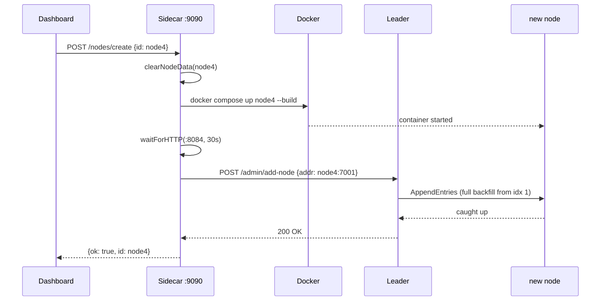
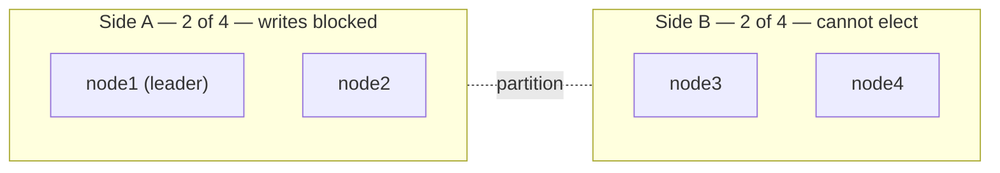
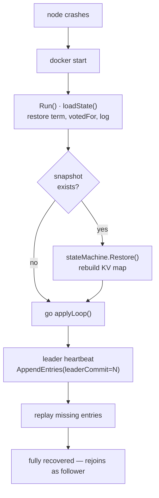

# Raft — Visual Reference

Key concepts illustrated with Mermaid diagrams.

---

## Node Roles & State Transitions

Every node starts as a **Follower**. When no heartbeat arrives before its randomised election
timeout (500–1000 ms), it becomes a **Candidate** and solicits votes. Winning a majority
makes it **Leader**; seeing a higher term at any point resets it to Follower.

---

## Log Replication

The leader appends the client command, fans out `AppendEntries` to all followers in
parallel, and commits once a **majority** acknowledge. The commit result is applied to
the state machine before replying to the client.

---

## Leader Election

When a leader goes offline, the first follower whose timer fires initiates an election.
Randomised timeouts ensure only one candidate wins in most cases.

---

## Write Path — Client PUT via Follower

A `PUT` to a follower is automatically redirected to the leader (HTTP 302).
The leader replicates and commits before responding.

---

## Read Path — Client GET (Stale Read)

Reads are served **locally** by whichever node receives the request — no Raft round-trip,
but the result may be up to one heartbeat interval (~100 ms) stale.

---

## System Architecture

---

## Node Join — Live Membership Change

Adding a new node to a running cluster: sidecar wipes stale state, starts the container,
then calls `add-node` on the leader. The leader backfills the log immediately.

---

## Network Partition — Split Brain Prevention

With 4 nodes, a 2–2 split leaves **neither** side with a majority. The old leader
cannot commit, and the minority side cannot elect a new one. Both sides deadlock
safely until the partition heals.

---

## Crash Recovery

A restarted node replays from its persisted log and snapshot, then catches up
via heartbeats from the leader — no data loss.

---

## Package Dependency Map

```mermaid
graph TD
    CMD["cmd/kvstore\nmain.go"]
    KV["kvstore/\nKVStore · StateMachine"]
    RAFT["raft/\nRaftNode · Log · Election\nReplication · Snapshot"]
    PROTO["proto/\nraft.proto → gRPC stubs"]
    GRPC["transport_grpc.go\nHTTP/2 + protobuf"]
    MEM["transport_memory.go\nin-process transport (tests)"]
    SIDECAR["cmd/sidecar\n:9090 — Docker bridge"]
    DASH["dashboard/\nReact + Vite :5173"]

    CMD --> KV
    CMD --> RAFT
    RAFT --> PROTO
    RAFT --> GRPC
    RAFT --> MEM
    DASH -->|"HTTP REST"| SIDECAR
    SIDECAR -->|"docker + /admin API"| CMD
```

